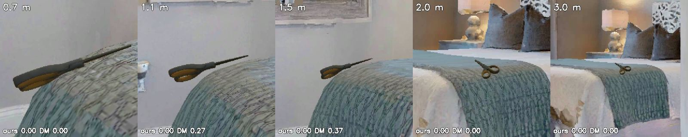
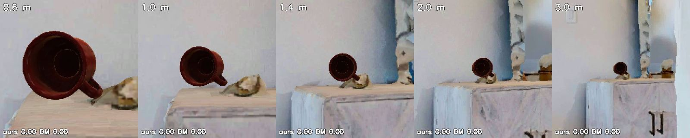
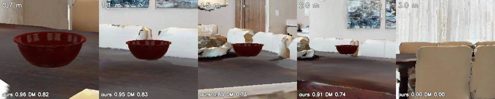
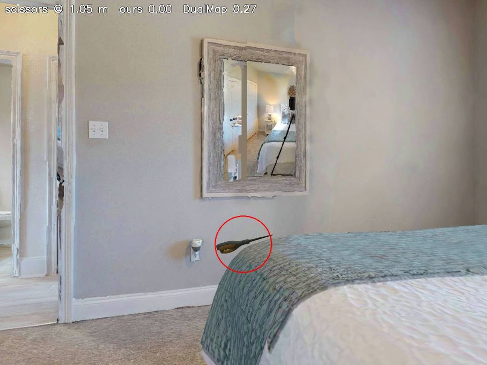
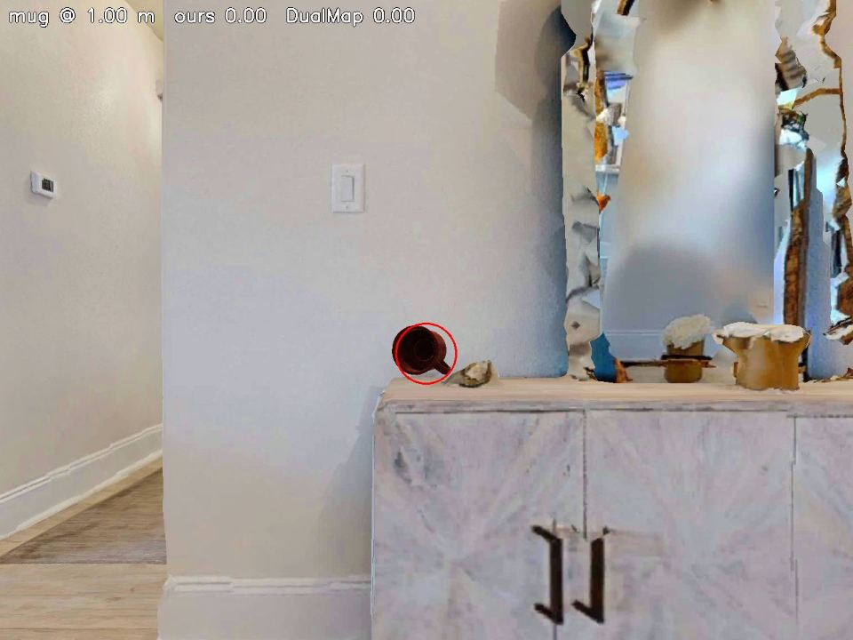
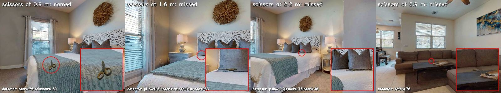
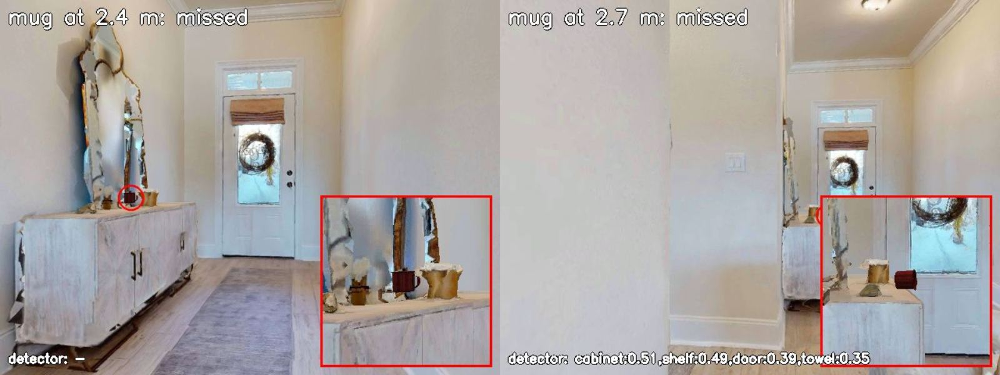

# Scissors and mug: the evidence for replacing them in the dynamic benchmark

The case in one paragraph: two of the eight movable objects in DualMap's
released dynamic benchmark, `037_scissors` and `025_mug`, are not recognised
by the object detector of *either* system at the ranges a search operates
at. On identical frames, ours and DualMap's `yolov8l-world` both score the
scissors at 0.01-0.06 recall and the mug at 0.00-0.06; on controlled renders
at 0.6-3 m the "mug" class never fires for either detector, even at 0.6 m
where the object fills 150 pixels. The successes both systems record on these
two objects come from standing near the anchor (in-anchor, where a do-nothing
agent already scores 74%) or, for DualMap's mug, from a CLIP text-to-feature
match on a detection its detector had labelled "speaker" -- a property of the
matching method, not of the object. Keeping the two assets makes the dynamic
benchmark measure asset renderability and matching method on 24 of 107
trials; replacing them makes it measure the search both papers claim to
measure. Every number below is reproducible from the scripts named at the end.

Images: `docs/assets/asset_evidence/` (renders from
`scripts/render_asset_views.py`, real frames from the tight-ring run's
ground-truth dump).

## 1. What the two objects look like to the agent

Controlled renders. The object is placed by the protocol environment exactly
as in the released layout (00848, in-anchor layout 0116), the camera is put on
the navmesh at 0.6, 1.0, 1.5, 2.0 and 3.0 m facing it, at the agent's height
and optics (1280x960, 79 deg HFOV). Under each crop: the best score of the
right label covering the object's pixel, ours (YOLOE, the vocabulary the
agent uses for that query) and DualMap's (`yolov8l-world.pt`, its own
305-class list, imgsz 1280).

**Scissors** -- ours 0.00 at every range; DualMap 0.27 and 0.37 at 1.0 and
1.5 m, 0.00 at 0.7, 2.0 and 3.0 m.

**Mug** -- ours 0.00 and DualMap 0.00 at every range. DualMap's top labels on
the object: "speaker" 0.40 at 0.6 m, "speaker" 0.35 at 1.0 m, "fan" 0.31 at
2.0 m. Ours: nothing, or "red plate" 0.30 at 1.4 m.

**Bowl, for comparison** -- ours 0.96/0.95/0.85/0.91 and DualMap
0.82/0.83/0.72/0.74 at 0.7-2.0 m (3.0 m occluded by furniture).

The agent's whole view at 1 m, scissors and mug:

Real frames from our runs, chosen at increasing range from the ground-truth
dump (object in view, unoccluded, centred), with our detector's top labels
on the frame:

## 2. Both detectors on the same frames

The tight-ring run's ground-truth dump holds every keyframe on which the
target was in front of the camera and unoccluded: 4,274 frames over the eight
objects. Our recall, restricted to centred views (off-axis <= 0.5, visible
fraction >= 0.9), and DualMap's detector run over the same frames
(`scripts/detector_bakeoff.py`, gate 0.20):

| object | frames (ours, centred) | ours recall | ours < 1.5 m | 1.5-2.5 m | > 2.5 m | DualMap frames | DualMap recall |
|---|---:|---:|---:|---:|---:|---:|---:|
| bowl | 121 | **0.97** | 23/25 | 44/44 | 50/52 | 194 | **0.85** |
| plate | 128 | 0.55 | 28/28 | 32/50 | 10/50 | 307 | 0.18 |
| pitcher | 173 | 0.46 | 16/56 | 20/42 | 44/75 | 301 | 0.08 |
| cracker box | 81 | 0.23 | 3/8 | 10/31 | 6/42 | 151 | (not in list) |
| soup can | 132 | 0.17 | 5/15 | 15/30 | 3/87 | 257 | 0.21 |
| banana | 65 | 0.09 | 6/7 | 0/21 | 0/37 | 100 | 0.00 |
| **scissors** | 179 | **0.01** | 2/17 | 0/37 | 0/125 | 352 | **0.04** |
| **mug** | 114 | **0.00** | 0/2 | 0/3 | 0/109 | 160 | **0.06** |

The two objects are last for both detectors. It is not the name, the
competition or the scale: `scripts/probe_nearmiss.py` re-ran our detector
over the 352 scissors and 160 mug frames with ten alternative names, with
every furniture class removed, and on an upscaled window around the object,
and got 0/352 and 0/160 in every condition (only "cup" reached 9/160).

## 3. Why: the assets, not the size

| object | YCB asset | size (cm) | thinnest side | pixels at 2 m, ours / DualMap |
|---|---|---|---:|---:|
| scissors | 037_scissors | 20.2 x 9.6 x **1.6** | 1.6 cm | 78 / 61 long, **6 / 5** thick |
| mug | 025_mug | 11.7 x 9.3 x 8.1 | 8.1 cm | 45 / 35 |
| soup can | 005_tomato_soup_can | 10.2 x 6.8 x 6.8 | 6.8 cm | 40 / 31 |
| bowl | 024_bowl | 16.1 x 16.1 x 5.5 | 5.5 cm | 62 / 48 |
| banana | 011_banana | 17.8 x 10.9 x 3.7 | 3.7 cm | 69 / 53 |
| cracker box | 003_cracker_box | 21.3 x 16.4 x 7.2 | 7.2 cm | 83 / 64 |
| plate | 029_plate | 26.1 x 26.0 x 2.7 | 2.7 cm | 101 / 78 |
| pitcher | 019_pitcher_base | 24.2 x 14.9 x 14.5 | 14.5 cm | 94 / 73 |

(Our camera: 1280 px wide, 79 deg HFOV, fx 776. DualMap's: 1200 x 680, fx
600, on a 1.5 m robot.)

- **Scissors** lie flat on a bed or a desk and the camera looks at them from
  0.9-1.5 m above: a 1.6 cm edge, five or six pixels tall at 2 m, dark grey
  on a patterned bedspread. In the real frames the whole object is a smudge
  a pillow's shadow could be. Both detectors see the bed.
- **Mug** is not a size problem: the soup can is smaller on every axis and
  both detectors name it (0.17 / 0.21). The YCB mug is a matte dark-red
  cylinder with almost no texture, and at 0.6 m, 150 pixels across, both
  detectors call it a speaker, a can or a plate. The asset does not look like
  what either model has learned "mug" means.

## 4. How each system scores them anyway

Success on the dynamic benchmark, ours (`island_close`, 107 trials) and
DualMap (its own code, seeds 12-14, 321 trials):

| object | ours dynamic | DualMap dynamic | DualMap in-anchor | DualMap cross-anchor |
|---|---:|---:|---:|---:|
| bowl | 10/12 | 26/36 | 17/18 | 9/18 |
| plate | 10/18 | 26/54 | 14/27 | 12/27 |
| soup can | 8/12 | 20/36 | 16/18 | 4/18 |
| cracker box | 9/17 | 18/51 | 15/27 | 3/24 |
| pitcher | 8/18 | 12/54 | 5/27 | 7/27 |
| banana | 4/6 | 6/18 | 6/9 | 0/9 |
| **scissors** | 3/18 | 24/54 | **19/27** | **5/27** |
| **mug** | 5/6 | 26/27 | 9/9 | 8/9 |

**Scissors.** DualMap's 70% in-anchor is the anchor, not the object: in-anchor
the object moves 0.7 m and a do-nothing agent scores 74%
(`DUALMAP_OFFICIAL_RERUN.md`). Its per-trial records show the successful
stops made with the global candidate "bed" or with a local path and zero
false matches at keyframe 31-54, i.e. on arrival at the bed; its cross-anchor
scissors is 5/27, and 14 of the 27 cross-anchor trials end with three false
local matches. Ours is 2/9 and 1/9 -- three genuine live detections at
0.03-0.06 m from the object, all under a metre.

**Mug.** DualMap scores 26/27 with `local_path_found` and zero false matches,
naming the object at a median 2.8 m. Its detector cannot do that (0.06 on our
frames, 0.00 on the renders); its *matcher* can:
`find_best_candidate_with_inquiry` in `utils/local_map_manager.py` and
`utils/global_map_manager.py` ranks map objects by the cosine similarity
between the CLIP text feature of the query and the object's CLIP image
feature, regardless of the detector's label. The "speaker" at 0.40 is a
mug-shaped red object to CLIP. Ours is label-driven and gets 0/114; our five
successes are two genuine detections at 0.62 and 0.01 m and three stops that
happened to land within a metre while walking to something else (no
detection in the episode).

So on these two objects the benchmark does not measure search. It measures
whether an agent happens to stand near the anchor (scissors in-anchor, 70%
vs 18.5%) and whether its matcher is label-free (mug, 26/27 vs a detector
that never names it). Neither is what the dynamic conditions were built to
test, and both confound a comparison between the systems.

## 5. What replacing them does, for both systems

- 24 of 107 dynamic trials (18 scissors, 6 mug) become trials the search can
  win or lose on its merits, for both systems. Our attainable ceiling
  in-anchor rises from 42 to 54 trials; DualMap's cross-anchor scissors
  (5/27) stops dragging its own number.
- The positions, anchors and layouts are unchanged: the substitution is the
  asset id in 12 layout files (`dynamic_scene_config/*/0116-0118, 0128-*,
  0129-*` for scissors and the 00848 mug layouts). Nothing about the
  displacement statistics (0.7 m in-anchor, 5.6 m cross-anchor) moves.
- The replacement must pass the same test the two failed: both detectors
  >= 0.5 at 2 m on the render test (`scripts/render_asset_views.py`), size
  in the 10-25 cm class. Candidates from the YCB set already in the
  collector: `021_bleach_cleanser` (recall 0.54 in the authored layouts),
  `006_mustard_bottle`, `004_sugar_box`, `010_potted_meat_can`. Run the render
  test before choosing.
- Cost: DualMap rerun on 24 trials x 3 seeds (about 10 h on this GPU), ours
  about 1.5 h.

The alternative that keeps the assets is to add DualMap's mechanism to our
pipeline (CLIP re-ranking of detections against the query). It would help our
mug and nothing else; it does not make the scissors visible to anyone, and it
leaves the two objects measuring matching method rather than search.

## Reproduce

- Renders and both detectors' scores: `scripts/render_asset_views.py`
  (`outputs/asset_evidence/views.json`).
- Both detectors on the dumped frames: `scripts/detector_bakeoff.py`
  (`outputs/nearmiss_tightring/BAKEOFF_ALL.md`); name/competition/scale
  probe: `scripts/probe_nearmiss.py`.
- Ours per object: `outputs/osg_close_full`; DualMap per trial:
  `outputs/dualmap_official_bench/seed1{2,3,4}/trials/*/result.json` and
  `trace.jsonl` (`has_local_path`, `candidate`, `false_match_count`).
- Asset sizes: YCB meshes under the collector's `versioned_data/ycb`.
